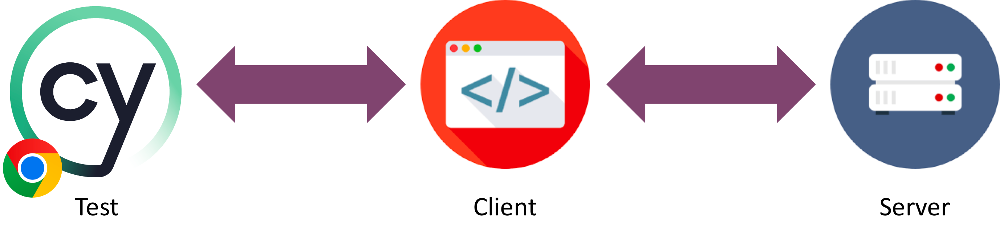

# OVERVIEW AND INSTALLATION

## Welcome !

These pages serve as documentation for the Cypress Training. You can work through the exercises at your own pace.

The system under test that we will be using is a tabular music tracker. It consists out of a server part, which interfaces with the database. The more visible part is the client, running in your browser as a VueJS project. We will focus on testing the client with Cypress.io.



## Running the project

In order to run the project locally, it is required that you have `node` and `git` installed. For `node` version 18 or higher is required.

If you don't have these installed yet you can find them here:

- <https://nodejs.org/en/download/>
- <https://git-scm.com/download/>

Afterwards follow the instructions in the next section 'Checking out the project'.

## Checking out the project

1. Clone the [project from GitHub](https://github.com/xebia/cypress-training) from within your terminal:

```bash
npx degit https://github.com/xebia/cypress-training.git
```

## Starting the client & server

1. Next we will start both the client and the server from within the terminal

From the root of the project run the following commands:

```bash
     cd server
     npm install
     npm start
```

In another terminal, run the following:

```bash
    cd client
    npm install
    npm start
```

Now go to <http://localhost:8080> to check if everything is running correctly.

If the client will fail starting up and returns an error with something like this:
`Error: error:0308010C:digital envelope routines::unsupported`

- Macos (one-liner)

`export NODE_OPTIONS=--openssl-legacy-provider && npm run start`

- Windows (run both commands seperate)

`set  NODE_OPTIONS=--openssl-legacy-provider`
`npm run start`

## Installing Cypress

The Training App is a monorepo containing both the client and the server. We will be testing the client with Cypress. <br>
❗ This means that we want to install Cypress in the client folder

So navigate to the client folder

And by typing `npm install cypress --save-dev` NPM will do 2 things:

- download Cypress into the node_modules folder
- add Cypress (and all packages it depends on) to package.json


## Running Cypress

❗❗ Because have installed Cypress from within the client folder, Cypress needs to be started from within the client folder.

To run Cypress simply run the following command from within the client folder:

`npx cypress open`

This will open the Cypress GUI for you and asks weather you want to start the Cypress Journey within your project
with End-to-End testing (E2E) or with Component testing. This training is focussed on writing E2E tests, so you can select the
E2E panel.

Then Cypress will inform you about the files it added to the project. You can click 'Continue' to Continue. Yes. Cypress is THAT easy 😄

> Cypress will ask you to create some demo tests; please choose for the empty project so we have a clean setup to begin with.

### About NPM

NPM stands for Node Package Manager. See [npmjs.com](https://docs.npmjs.com/getting-started/what-is-npm#what-is-npm) for more info.
In both the folders 'server' and 'client' you find a file called package.json.
This package.json holds all the information (names, versions) about the npm packages that are used in the project.
When you start `npm install`, it gathers all the names and versions and tries to install these packages
from the public NPM repository.

Package.json also stores some executable commands as shortcuts.
In this case you may find in the package.json a line which states: "start": "node build/dev-server.js",
so you can type 'npm start' instead of 'node build/dev-server.js'.
