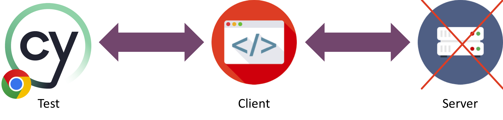

# ISOLATION

Cypress enables you to mock your network responses without having to run a dedicated mock server.
By removing (external) dependencies you can create specific test situations that are not depending on external systems and run your test in isolation.

In this exercise you will learn how to setup a mocked test and use routing to fake network responses.



## Exercise: Replace basic response data with an empty body

For this exercise you will still be using the [TabTracker](https://github.com/codyseibert/tab-tracker/) that was also used during the other exercises.

Using [cy.intercept()](https://docs.cypress.io/api/commands/intercept) makes it possible to 'spy' or 'mock' your backend calls. This means that you can intercept the request from your client and return a custom response (with mock data). This is very useful when you want to test your application in isolation. You can also use this to test your application when your backend is not yet ready. (This last scentence was 100% created by Github Copilot 🙌 😏)

Cypress Intercept works as follows:
When Cypress loads your client application, it loads the application in an iFrame. This iFrame is loaded with a proxy server that is able to intercept all network calls going out from your client application. When you use `cy.intercept()` you are able to intercept the request and return a custom response.

Important to remember: often, when an application loads, it sends some requests to a backend to retrieve data. This means that when you want to mock that call or to spy on it (letting the request pass through to the backend but want to assert on the request), you need to set the cy.intercept **before** you do a cy.visit to the application.

1. Create a new spec file and create a new test.
2. Use cy.intercept to add a response to the intercepted call, add an empty body: `{}` to the response within the intercept.
   because you add a body to the intercept, you 'mock' the API-request.
3. assert within the Cypress UI that the response is empty.
4. assert within the Cypress UI that the intercept was called.

<!-- panels:start -->
<!-- tabs:start -->
<!-- tab: Answer -> -->

click on the "Example of a cy.intercept" tab to open the answer

<!-- tab: Example of a cy.intercept -->

```javascript
describe('testing the app in isolation', () => {
  it('should mock the response', () => {
    cy.intercept('GET', '/songs', { body: {} });
    cy.visit('/');
  });
});
```

<!-- tabs:end -->
<!-- panels:start -->
<!-- div:title-panel -->
<!-- div:left-panel -->

## Exercise: Replace basic response data

For this exercise you will still be using the [TabTracker](https://github.com/codyseibert/tab-tracker/) that was also used during the other exercises. **Make sure to only run the client and NOT the server for this exercise**.

When you start the TabTracker you will see an empty application. When you open your browsers development tools, you will see that the application is trying to retrieve a list of Songs. Since your server isn't running it returns an empty response on the GET request. We want to return at least one song to fill the Songs list.

1. Create a new spec file and set the baseURL to your TabTracker application.
1. Use [cy.intercept()](https://docs.cypress.io/api/commands/intercept) to route the songs GET request to a fixture file, replacing the empty response with mocked data. You can use the JSON below as an example.
1. Assert that the title and artist are returned correctly.

<!-- panels:start -->
<!-- tabs:start -->
<!-- tab: open answer 👉 -->

click on the "the mock data" tab to see how the mock data should look like

click on the "intercept" tab to see how the intercept should look like

<!-- tab:the mock data -->

```json
[
  {
    "id": 9,
    "title": "Bangerang",
    "artist": "Skrillex",
    "genre": "Dubstep",
    "album": "Bangerang",
    "albumImageUrl": "https://en.wikipedia.org/wiki/Bangarang#/media/File:BangarangSkrillex.jpg",
    "youtubeId": "https://www.youtube.com/watch?v=YJVmu6yttiw",
    "lyrics": "2",
    "tab": "1",
    "createdAt": "2018-10-30T08:44:53.759Z",
    "updatedAt": "2018-10-30T08:44:53.759Z"
  }
]
```

<!-- tab: intercept -->

```javascript
describe('testing the app in isolation', () => {
  it('replace basic response data', () => {
    cy.intercept('GET', '/songs', {
      body: [
        {
          id: 9,
          title: 'Bangerang',
          artist: 'Skrillex',
          genre: 'Dubstep',
          album: 'Bangerang',
          albumImageUrl:
            'https://en.wikipedia.org/wiki/Bangarang#/media/File:BangarangSkrillex.jpg',
          youtubeId: 'https://www.youtube.com/watch?v=YJVmu6yttiw',
          lyrics: '2',
          tab: '1',
          createdAt: '2018-10-30T08:44:53.759Z',
          updatedAt: '2018-10-30T08:44:53.759Z',
        },
      ],
    });
    cy.visit('/');
    cy.contains('Bangerang');
  });
});
```

<!-- tabs:end -->
<!-- panels:start -->
<!-- div:title-panel -->
<!-- div:left-panel -->

## Exercise: Standard responses

The intercept takes multiple arguments. With these arguments you can control the basic response of the mock server.

Adding to the test that you've created in the previous step:

1. Modify the mock in such a way that the song information is only displayed after 10 seconds. What happens to your assertion?
2. Please fix your assertion so that it does not time-out. You can do it in multiple ways.
   1. Add an alias to your `cy.intercept` and wait for the alias to be called
   2. extend the timeout of your assertion
   3. extend the timeout of your complete testsuite

<!-- panels:start -->
<!-- tabs:start -->
<!-- tab: open answer 👉 -->

yes, tabs again ;)

<!-- tab: intercept -->

```javascript
describe('testing the app in isolation', () => {
  it('replace basic response data with a delay of 10 sec', () => {
    cy.intercept('GET', '/songs', {
      body: [
        {
          id: 9,
          title: 'Bangerang',
          artist: 'Skrillex',
          genre: 'Dubstep',
          album: 'Bangerang',
          albumImageUrl:
            'https://en.wikipedia.org/wiki/Bangarang#/media/File:BangarangSkrillex.jpg',
          youtubeId: 'https://www.youtube.com/watch?v=YJVmu6yttiw',
          lyrics: '2',
          tab: '1',
          createdAt: '2018-10-30T08:44:53.759Z',
          updatedAt: '2018-10-30T08:44:53.759Z',
        },
      ],
      delay: 10000,
    });
    cy.visit('/');
    cy.contains('Bangerang');
  });
});
```

<!-- tab: mocked intercept with delay -->

```javascript
it('replace basic response data with a delay of 10 sec with alias', () => {
  cy.intercept('GET', '/songs', {
    body: [
      {
        id: 9,
        title: 'Bangerang',
        artist: 'Skrillex',
        genre: 'Dubstep',
        album: 'Bangerang',
        albumImageUrl:
          'https://en.wikipedia.org/wiki/Bangarang#/media/File:BangarangSkrillex.jpg',
        youtubeId: 'https://www.youtube.com/watch?v=YJVmu6yttiw',
        lyrics: '2',
        tab: '1',
        createdAt: '2018-10-30T08:44:53.759Z',
        updatedAt: '2018-10-30T08:44:53.759Z',
      },
    ],
    delay: 10000,
  }).as('mockAlbums');
  cy.visit('/');
  cy.wait('@mockAlbums');
  cy.contains('Bangerang');
});
```

<!-- tab: mocked intercept with extended timeout on assert -->

```javascript
it('replace basic response data with a delay of 10 sec with alias with extended timeout on contains', () => {
  cy.intercept('GET', '/songs', {
    body: [
      {
        id: 9,
        title: 'Bangerang',
        artist: 'Skrillex',
        genre: 'Dubstep',
        album: 'Bangerang',
        albumImageUrl:
          'https://en.wikipedia.org/wiki/Bangarang#/media/File:BangarangSkrillex.jpg',
        youtubeId: 'https://www.youtube.com/watch?v=YJVmu6yttiw',
        lyrics: '2',
        tab: '1',
        createdAt: '2018-10-30T08:44:53.759Z',
        updatedAt: '2018-10-30T08:44:53.759Z',
      },
    ],
    delay: 10000,
  }).as('mockAlbums');
  cy.visit('/');
  cy.wait('@mockAlbums');
  cy.contains('Bangerang', { timeout: 11000 });
});
```

<!-- tab: mocked intercept with extended timeout on test -->

```javascript
it('replace basic response data with a delay of 10 sec with alias with extended timeout on contains', () => {
  cy.intercept('GET', '/songs', {
    body: [
      {
        id: 9,
        title: 'Bangerang',
        artist: 'Skrillex',
        genre: 'Dubstep',
        album: 'Bangerang',
        albumImageUrl:
          'https://en.wikipedia.org/wiki/Bangarang#/media/File:BangarangSkrillex.jpg',
        youtubeId: 'https://www.youtube.com/watch?v=YJVmu6yttiw',
        lyrics: '2',
        tab: '1',
        createdAt: '2018-10-30T08:44:53.759Z',
        updatedAt: '2018-10-30T08:44:53.759Z',
      },
    ],
    delay: 10000,
  }).as('mockAlbums');
  cy.visit('/');
  cy.wait('@mockAlbums');
  cy.contains('Bangerang', { timeout: 11000 });
});
```

<!-- tabs:end -->
<!-- panels:start -->
<!-- div:title-panel -->
<!-- div:left-panel -->

## Exercise: invoke a Request to reset endpoint

⚠️ for the next 2 exercises, start the server

The first two exercises focussed on API testing. Now it is time to 'drive' the backend by sending API requests to the backend.
This means that you can let Cypress interact with your Server the same way as your client would normally do. The API/backend response can then be asserted as usual.

Within this exercise we send a proper `cy.request`to the server that calls the reset-db function.
The API of the reset-db function on the server is `http://localhost:8081/reset` and is using the 'GET' method

- create a `cy.request` that calls the reset-db on the Server
- assert 'somehow' that the database was reset.
- add the reset-db call to the beforeEach of your test
- put the cy.request in a Custom Command
- redesign the interaction test from exercise 3 - make sure the reset-db runs before or after the insert new album - test

<!-- panels:start -->
<!-- tabs:start -->
<!-- tab: open answer 👉 -->

yes, tabs again ;)

<!-- tab: cy.request -->

```javascript
it.only('standard responses: invoke a request to reset endpoint', () => {
  cy.request('GET', 'http://localhost:8081/reset')
    .its('body.message')
    .should('eq', 'Delete Finished');
});
```

<!-- tab: cy.request using an alias -->

```javascript
it('standard responses: invoke a request to reset endpoint', () => {
  cy.request('GET', 'http://localhost:8081/reset').as('reset');
  cy.get('@reset').its('body.message').should('eq', 'Delete Finished');
});
```

<!-- tabs:end -->
<!-- panels:start -->
<!-- div:title-panel -->
<!-- div:left-panel -->

## Exercise: GET the Song from the backend using cy.request and assert the response

It is time for some API testing using Cypress.
Now you have made your first step with cy.request, it's time to level up.

There is a way to use a structured way to do do multiple assertions on the response of a cy.request.
We use a Cypress mechanism called 'callbacks' to do this.

We can use

<!-- panels:start -->
<!-- tabs:start -->

<!-- tab: cy.should -->

```javascript
cy.get('element').should('be.visible');
```

<!-- tabs:end -->
<!-- panels:start -->
<!-- div:title-panel -->
<!-- div:left-panel -->

but with the next implementation we can do multiple asserts on the same element.
with this implementation we 'store' the element in 'el' and can then use it in the callback function.

<!-- panels:start -->
<!-- tabs:start -->

<!-- tab: cy.should with callback -->

```javascript
cy.get('element').should((el) => {
  console.log(el); // yes, you can use console.log in Cypress
  expect(el).should('be.visible');
  expect(el).should('have.attr', 'href');
});
```

<!-- tabs:end -->
<!-- panels:start -->
<!-- div:title-panel -->
<!-- div:left-panel -->

- create a API-call requesting just one song
- assert (using an alias) that the server returned the proper song with the proper attributes

<!-- panels:start -->
<!-- tabs:start -->
<!-- tab: open answer 👉 -->

yes, tabs are so 2023 ;)

<!-- tab: cy.request -->

```javascript
it('Requests', () => {
  cy.request('GET', 'http://localhost:8081/songs/1').as('songs');
  cy.get('@songs').should((res) => {
    console.log(res.body.id);
    expect(res.body.id).to.eq(1);
  });
});
```

<!-- tabs:end -->
<!-- panels:start -->
<!-- div:title-panel -->
<!-- div:left-panel -->

### Need help?

- Use the network tab in the developer tools of your browser to help you find the calls that your client application is trying to make.
- Check out the [cy.intercept documentation](https://docs.cypress.io/api/commands/intercept) for the correct syntax
- Check out the [cy.request documentation](https://docs.cypress.io/api/commands/request) for the correct syntax
