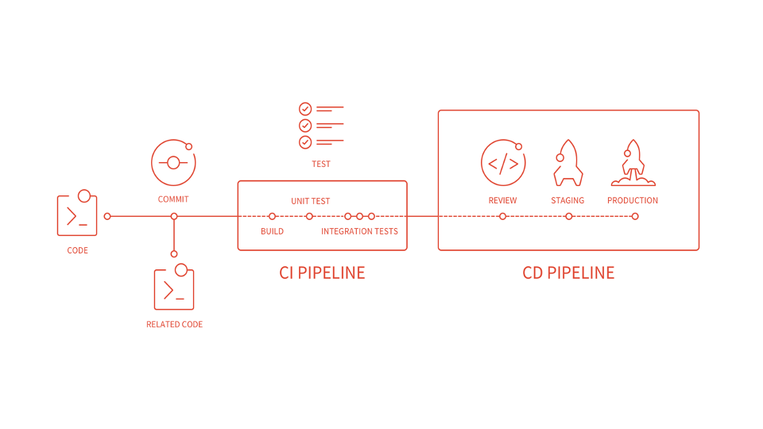

# Setup Cypress tests in CICD

# Running in Pipeline in Gitlab CI

One of the most powerful ways to run Cypress tests is as part of your CICD process. Get quick feedback running a subset of your tests using mocks during your CI and run sets of E2E tests or Synthetic tests during your CD process. 

The picture below shows a typical setup of a CICD pipeline setup.
 

## Exercise: Setup and create Cypress tests in GitLab CI

1. Go to <https://about.gitlab.com/free-trial/>
1. Login to your account or create a (free) account
1. Create a new project/repository
1. Clone repo on your machine
1. Run `npm init –y` 
1. Install Cypress in your project
1. Create a test
1. Create a `.gitlab-ci.yml` file
1. Run your tests on Gitlab.com

