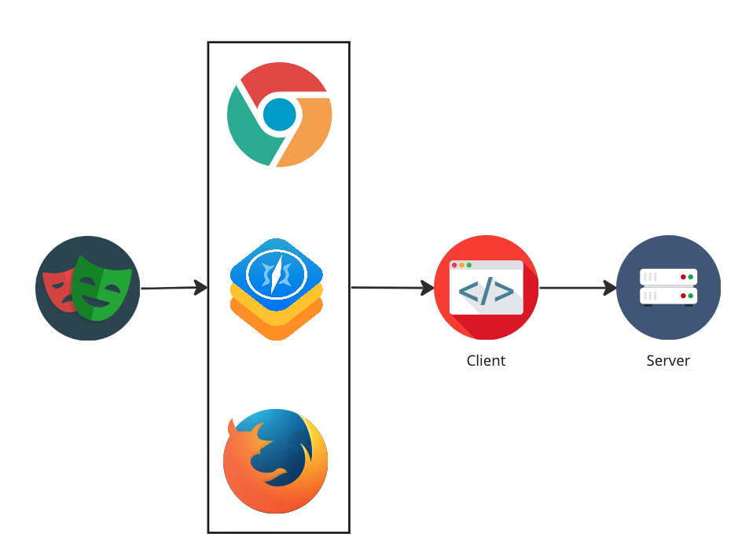

# Application integration
Up until now we have used a default Playwright test that navigates to the Playwright website and verifies the content is as expected. In a real world scenario we would like test our own application. In this exercise you will learn how to integrate Playwright with your application.

## The application
The application that we will be using is a tabular music tracker. It consists of a server part, which communicates to the database. The most visible part is the client, which runs in a browser. It is built with VueJS, which is a front end framework. 
We will focus on testing the client with Playwright.



## Exercise: Starting the client & server

TODO: In your Codesandbox IDE create a new terminal  by pressing [Ctrl + \`] (Windows) or [Cmd + \`] (macOS) or by clicking on this button in the bottom center column:

Create 2 terminals in VSCode before continuing. Recall that this can be done with [Ctrl + Shift + \`] (Windows) or [Cmd + Shift + \`] (macOS).

In the first terminal, from the root of the project run the following commands:

``` bash
     cd server
     npm i
     npm start
```

In the second terminal, run the following:

``` bash
    cd client
    npm i
    npm start
 ```

Check the URL of where you application is running inside Codesandbox. This is shown at the top of the right panel. It is typically a URL that `ends` with: `8081.csb.app` for the backend and `8080.csb.app` for the frontend.
In all the exercises that refer to localhost, replace this with the above 2 URLs.
So if you see `http://localhost:8080`, replace it with the URL that ends with `8080.csb.app` and if you see `http://localhost:8081`, replace it with `...8081.csb.app` 

Open the [Api.js](../../../client/src/services/Api.js) and replace the baseUrl with your `...8081.csb.app`. 
```javascript
baseURL: `https://[your_id]-8081.csb.app/`,
```

Now go to http://localhost:8080 to check if everything is running correctly.

### About NPM

NPM is a package manager for Node.js. See [npmjs.com](https://docs.npmjs.com/getting-started/what-is-npm#what-is-npm) for more info.
In both the folders 'server' and 'client' you find a file called package.json.
This package.json holds all the information (names, versions) about the npm packages that are used in the project.
When you run `npm i`, it gathers all the names and versions and tries to install these packages from the public NPM registry.

The package.json file also defines scripts as shortcuts.
In this case you may see a line in the `client/package.json` with: "start": "node build/dev-server.js".
This will allow you to type `npm run start` in your terminal instead of `node build/dev-server.js`.


## Exercise: Recording your first test
Once the client is started, the browser is automatically opened. Let's get started and record our first test. Later we can focus on the syntax.

1. Create a new test file based on the one that you created in the `"1. Your first test"` chapter.
2. Change you static main to something that makes sense and add a TestNG annotation to the method.
3. Run the test in such a way that the Playwright inspector is opened. Recall you can do this with the `pause()` method.
4. Click on `Record`.
5. Click around a bit depending on what you would like to test and click on `Record` when you are done.
6. Copy the code to your test file.
7. You will see some duplicate code, but for now let's try to run the test by clicking on the play button on the left in your IDE.
8.  Check that your test has passed.
9.  If your tests is too slow, you may have forgotten to remove the `setSlowMo` method.

## Exercise: Cleaning up
Clean code is what we should strive for. The same holds for tests. See if you can remove duplicate test steps and shave off some time from the total test run.